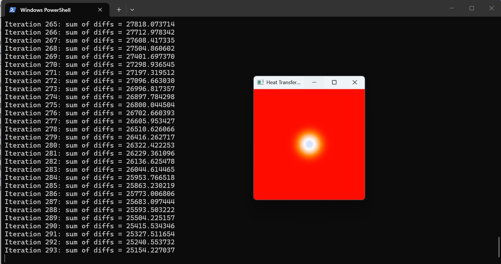

# Heat Transfer Simulation
This is a simple heat transfer simulation implemented in C++. The program simulates the diffusion of heat in a 2D grid over time,
using the Finite Difference Method for the Heat Transfer equation. The simulation parameters can be adjusted to see
how they affect the heat distribution.

This project involves developing a GPU-accelerated numerical simulation of 2D transient heat conduction on a conductive metal plate.
The simulation models how thermal energy spreads from a constant heat source across a surface until it reaches a state of
thermal equilibrium.

The simulation treats a metal plate as an $M \times N$ matrix. Starting from an initial ambient temperature ($T_R$), a constant
heat source ($T_S$) is introduced at a specific coordinate $(x_0, y_0)$.
The propagation of heat is calculated iteratively using a 3x3 mean filter. The temperature of a point at time $t+1$ is the average of itself and its eight immediate neighbors at time $t$:

$P[x,y](t+1) = \frac{1}{9} \sum_{i=-1}^{1} \sum_{j=-1}^{1} P[x+j, y+i](t)$

This calculation represents a discrete convolution where each cell's new state depends on the local 3x3 neighborhood.


# Hardware limitations
This application uses CUDA for parallel processing, which allows it to run efficiently on compatible NVIDIA GPUs. However,
the performance of the simulation may be limited by the hardware capabilities of the GPU, such as the number of CUDA cores
and available memory.
Moreover, not having a compatible NVIDIA GPU will prevent the application from running, as it relies on CUDA for its computations.
It is important to ensure that your system meets the necessary hardware requirements to run this simulation effectively.

# Usage
To compile the program, import the project in your C++ development environment (Visual Studio) and build the solution.
To run the simulation, use the following command:
``` .\HeatTransferSimulation.exe 256 256 250 128 128 10000000 300 1000 ```
The command line arguments are as follows:
- M: the size of the grid in the x-dimension
- N: the size of the grid in the y-dimension
- EPS: the tolerance for convergence
- x0: the initial x-coordinate of the heat source
- y0: the initial y-coordinate of the heat source
- source_temperature_celsius: the temperature of the heat source in Celsius
- boundary_temperature_celsius: the temperature of the boundaries in Celsius
- max_iterations: the maximum number of iterations to run the simulation

# Output
During the simulation, the program will display the current state of the simulation (the temperatures in every grid position)
in a new window. After the simulation has converged or reached the maximum number of iterations, the program will output the
final temperature distribution in the grid. The output will be in the form of a 2D array (of the size of the grid, MxN),
where each element represents the temperature at that point in the grid (R, G , B temperature channel).




 

# Convergence
The simulation will continue to iterate until the maximum change in temperature between iterations is less than the specified tolerance
(EPS) or until the maximum number of iterations is reached. This ensures that the simulation has converged to a stable solution
before it stops.
$$\Delta T_{max} < \epsilon$$
 
# Performance
The performance of the simulation can be affected by the size of the grid and the number of iterations. Larger grids and more iterations
will require more computational resources and time to complete. It is recommended to start with smaller grid sizes and fewer iterations
to test the program before scaling up to larger simulations.
 
# Conclusion
This heat transfer simulation provides a basic framework for understanding how heat diffuses in a 2D space. By adjusting the parameters,
users can explore different scenarios and observe how heat distribution changes over time. This can be useful for educational purposes
or as a starting point for more complex simulations in the future.